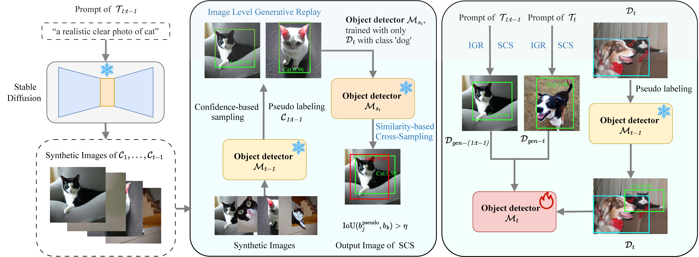

## Revisiting Generative Replay for Class Incremental Object Detection

Official Pytorch implementation for "Revisiting Generative Replay for Class Incremental Object Detection", CVPR 2025 Poster.



[[Paper](https://openaccess.thecvf.com/content/CVPR2025/html/Zhang_Revisiting_Generative_Replay_for_Class_Incremental_Object_Detection_CVPR_2025_paper.html)]

## 🚀 Contributions

- Instead of developing a costly generative model for complex scenarios and multi-class instances in CIOD, we propose using an existing SD model for image-level generative replay for all tasks, preserving knowledge and bridging the gap between generated and real images.
- We propose to employ a SCS method to sift through and pinpoint more difficult samples across both old and new tasks. This approach substantially reduces false alarms for the new task while effectively retaining the previously acquired knowledge.
- We perform extensive experiments on the PASCAL VOC and MS COCO datasets under various settings, and our proposed approach attains state-of-the-art results when compared to other current methods.

## Get Started

- This repo is based on [MMDetection 3.3](https://github.com/open-mmlab/mmdetection). Please follow the installation of MMDetection [GETTING_STARTED.md](https://mmdetection.readthedocs.io/en/latest/get_started.html) and make sure you can run it successfully.
```bash
conda create -n RGR-IOD python=3.8 -y
source activate RGR-IOD
pip install torch==1.11.0+cu113 torchvision==0.12.0+cu113 torchaudio==0.11.0 --extra-index-url https://download.pytorch.org/whl/cu113
pip install -U openmim
mim install mmengine==0.8.5
mim install mmcv==2.0.0
cd our project
pip install -v -e .
```

## Dataset
- Unzip COCO dataset into ./data/coco/
- Run ./script/select_categories_2step.py and select_categories_nstep.py to split the COCO dataset
```python
# Two-step(40+40): 
python ./script/select_categories_2step.py  # to generate instances_train2017_0-39.json and instances_train2017_40-79.json, which is placed in ./data/coco/annotations/40+40
# Multi-step(40+10*4) trainset:
python ./script/select_categories_nstep_train.py # divide instances_train2017_40-79.json into 4 steps [40-49, 50-59, 60-69, 70-79], which is placed in ./data/coco/annotations/40+10_4
# Multi-step(40+10*4) valset:
python ./script/select_categories_nstep_val.py  # divide instances_val2017.json, the valset is [0-49, 0-59, 0-69, 0-79(original file)]
```

## Checkpoints
The base phase weights and dataset splits(40+40, 40+10_4, 70+10) can be obtained from [GoogleDriver](https://drive.google.com/drive/folders/1LqNSDyWEiAQ-Me8amLMWelnS_V8DhoJE?usp=drive_link)

## Train
```python
# assume that you are under the root directory of this project,

# Two-step(70+10)
CUDA_VISIBLE_DEVICES=0,1,2,3 bash ./tools/dist_train.sh ./configs/gdino_inc/70+10/gdino_inc_70+10_0-69_scratch_coco.py 4   # train first 70 cats
CUDA_VISIBLE_DEVICES=0,1,2,3 bash ./tools/dist_train.sh ./configs/gdino_inc/70+10/gdino_inc_70+10_70-79_gcd_scratch_coco.py 4 --amp # train last 10 cats incrementally

# Multi-step(40+10*4)
CUDA_VISIBLE_DEVICES=0,1,2,3 bash ./tools/dist_train.sh ./configs/gdino_inc/40+40/gdino_inc_40+40_0-39_scratch_coco.py 4   
CUDA_VISIBLE_DEVICES=0,1,2,3 bash ./tools/dist_train.sh ./configs/gdino_inc/40+10_4/gdino_inc_40+10_4_40-49_gcd_scratch_coco.py 4 --amp
CUDA_VISIBLE_DEVICES=0,1,2,3 bash ./tools/dist_train.sh ./configs/gdino_inc/40+10_4/gdino_inc_40+10_4_50-59_gcd_scratch_coco.py 4 --amp
CUDA_VISIBLE_DEVICES=0,1,2,3 bash ./tools/dist_train.sh ./configs/gdino_inc/40+10_4/gdino_inc_40+10_4_60-69_gcd_scratch_coco.py 4 --amp
CUDA_VISIBLE_DEVICES=0,1,2,3 bash ./tools/dist_train.sh ./configs/gdino_inc/40+10_4/gdino_inc_40+10_4_70-79_gcd_scratch_coco.py 4 --amp 
```

## Test
```python
CUDA_VISIBLE_DEVICES=0,1,2,3 bash ./tools/dist_test.sh ./configs/gdino_inc/70+10/gdino_inc_70+10_70-79_gcd_scratch_coco.py ./work_dirs/gdino_inc_70+10_70-79_gcd_scratch_coco/epoch_12.pth 4 --cfg-options test_evaluator.classwise=True
```

## Acknowledgement
Our code is based on the project [MMDetection](https://github.com/open-mmlab/mmdetection).
Thanks to the work [ERD](https://github.com/Hi-FT/ERD) and [CL-DETR](https://github.com/yaoyao-liu/CL-DETR).

## Citation
Please cite our paper if this repo helps your research:

```bibtex
@InProceedings{Zhang_2025_CVPR,
    author    = {Zhang, Shizhou and Lv, Xueqiang and Xing, Yinghui and Wu, Qirui and Xu, Di and Zhang, Yanning},
    title     = {Revisiting Generative Replay for Class Incremental Object Detection},
    booktitle = {Proceedings of the IEEE/CVF Conference on Computer Vision and Pattern Recognition (CVPR)},
    month     = {June},
    year      = {2025},
    pages     = {20340-20349}
}
```


